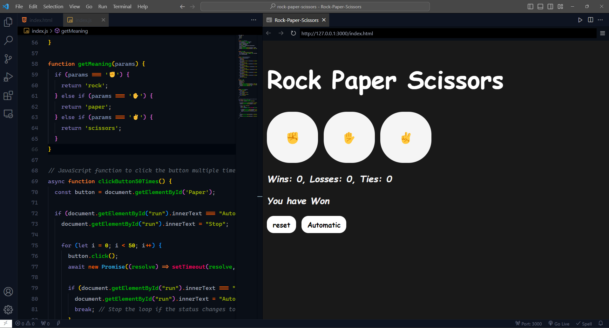
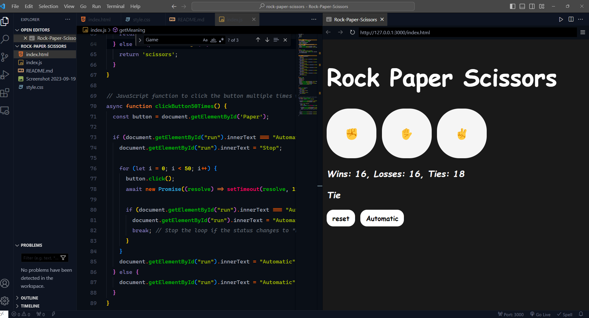

# Rock-Paper-Scissors Game
## Demo Video
[Watch the gameplay demo](https://github.com/Ayanleaideed/Rock-Paper-Scissors-Game/blob/main/Demo_Video/Demo.mkv)

This is a simple implementation of the classic Rock-Paper-Scissors game built with JavaScript. Test your luck against the computer and keep track of your wins, losses, and ties.

## How to Play

1. Open the `index.html` file in your web browser.
2. Click on the hand symbols to make your choice: ✊ (rock), ✋ (paper), or ✌️ (scissors).
3. See the result of the game and check your score on the board.
4. Want to play automatically? Click the "Automatic" button to simulate 50 games in a row!

## Scoreboard

The scoreboard keeps track of your wins, losses, and ties. You can also reset the scores anytime by clicking the "Reset" button.

## Automatic Play

Want to see how lucky you are in a series of games without clicking manually? Click the "Automatic" button, and the game will play 50 rounds automatically. Click it again to stop the automatic play.

Have fun playing Rock-Paper-Scissors and enjoy the game!

---

**Note:** The project code can be found in the `index.js` file. Feel free to customize and extend it as needed.
